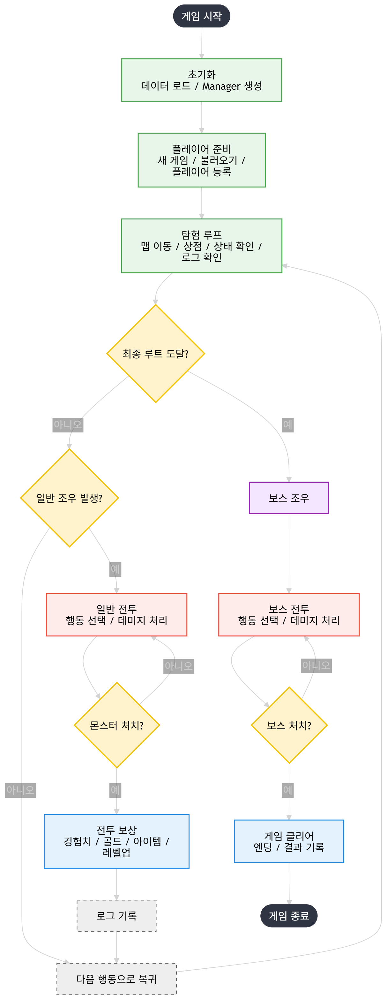

# CH2_Team_TextRPG

## 📜 1. 프로젝트 개요 (Overview)

**Terminal Spire**는 Slay the Spire에서 영감을 받은 **CTB(Conditional Turn-Based) 전투 기반의 로그라이크 텍스트 RPG**입니다. C++ 기반의 콘솔 환경에서 아스키 아트(ASCII Art)를 활용한 직관적인 UI를 제공하며, 외부 라이브러리(`nlohmann/json`)를 활용해 메타데이터를 효과적으로 관리합니다.

---

## ⚙️ 2. 시스템 아키텍처 (System Architecture)

* **컴포넌트 패턴 (Component Pattern):** 기능별로 모듈화하여 객체에 조립하는 방식 적용
* **최상위 기본 클래스 (Root Object):** 게임 내 모든 엔티티가 상속받는 최상위 Base 클래스 설계
* **오브젝트 매니저 (Object Manager):** 게임 내 생성되는 모든 객체의 생명주기(생성/파괴) 관리
* **유한 상태 머신 (FSM):** 게임 흐름(메인 메뉴 ↔ 마을 ↔ 탐험 ↔ 전투) 및 객체 상태 제어

## 🗺️ 3. 게임 플로우 차트 (Flow Chart)

## 🛠️ 4. 세부 구현 예정 기능

### 📑 4.1 플레이어 (Player)
* **데이터 영속성 (Save / Load):**
  * 스테이터스 정보 (현재 레벨, 경험치, 소지 골드 등)
  * 인벤토리 내 보유 아이템 목록
  * 현재 습득 및 장착 중인 스킬셋
* **직업별 플레이어 캐릭터 다양화:**
  * **전사 (Warrior):** 높은 체력과 방어력 위주, 물리 단일 공격 특화
  * **마법사 (Mage):** 높은 마나, 광역 마법 대미지 및 디버프 특화
  * **도적 (Rogue):** 높은 턴 속도(Action Speed), 타격 횟수 중심의 변칙적 플레이
* **인벤토리 시스템:**
  * 착용 가능한 장비 아이템 슬롯 관리
  * 소비성 아이템 및 특수 아이템 보관 슬롯 제한
* **핵심 스테이터스:**
  * 공격력, 방어력, 체력(HP), 마나(MP), **턴 속도(Action Speed)**

### 🧭 5.2 맵 종류 및 이벤트 (Map & Exploration)
* **몬스터 룸:** 일반 몬스터 무리와의 전투가 발생하며, 클리어 시 골드 및 아이템 보상 획득
* **상점 룸:** 탐험 중 모은 골드를 소모하여 고성능 장비, 소모품, 혹은 스킬북 구매 가능
* **랜덤 이벤트 룸:** 하이 리스크-하이 리턴형 선택지 제공
  * *예시:* 체력 증감, 갑작스러운 기습 몬스터 조우, 비밀 상점 발견, 저주 아이템 획득 등

### ⚔️ 5.3 전투 시스템 (Combat)
* **속도 기반 턴제 (Conditional Turn-Based):**
  * 고정된 순서로 턴이 도는 것이 아니라, 각 캐릭터의 '턴 속도' 스탯에 비례해 행동 게이지가 차오르고 100%에 도달한 캐릭터 순서대로 행동 권한을 얻음.
* **행동 비용 (Action Cost):**
  * 자신의 턴에 행동(기본 공격, 스킬 사용, 아이템 소모 등)을 수행하면 행동 게이지가 차감됨.
* **배수의 진 (도망 불가):**
  * 로그라이크의 긴장감을 극대화하기 위해 전투 중 도망치기 기능은 지원하지 않음.
* **패배 처리:**
  * 플레이어 사망 시 게임이 즉시 종료되며, 해당 회차의 '게임 진행 결과 로그'를 화면에 아스키 아트로 정돈하여 출력.
* **대미지 계산식:**
  * `최종 대미지 = ((공격력 * 스킬 배율) / 상대 방어력 배율) * 공격 횟수`
  * *주의:* 방어력 배율은 최소 1 이상의 상수를 유지하여 나누기 0(Divide by Zero) 에러 방지.

### 🔮 5.4 스킬 시스템 (Skills)
* **기본 핵심 스킬:**
  * **회복:** 마나를 소모하여 자신의 HP를 즉시 치유
  * **단일 대미지:** 하나의 적에게 높은 배율의 피해를 입힘
  * **범위 대미지 (AoE):** 현재 적 진영 전체에게 균등 혹은 확산 피해를 입힘
* **추가 구현 스킬 (개발 일정 유효 시):**
  * **버프:** 일정 턴 동안 자신의 공격력, 방어력, 혹은 턴 속도 증가
  * **디버프:** 적의 방어력을 깎거나 턴 게이지를 밀어냄 (Action Gauge Delay)
  * **지속 대미지 (DoT):** 출혈, 화상, 중독 등 매 턴 시작 시 대미지를 주는 상태이상

### 🎒 5.5 아이템 시스템 (Items)
* **장비 아이템 (스탯 장비):** 무기, 방어구, 장신구 등 착용 시 플레이어의 기본 스탯(깡스탯)을 상시 정량 증가시킵니다.
* **소비 아이템 (물약류):** 전투 중 혹은 탐험 중에 사용하여 HP/MP를 즉시 회복시킵니다.
* **특수 소모품 (전투용):** 일회성 폭탄, 주문서 등 마나 소비 없이 강력한 단발성 스킬 효과를 내는 아이템입니다.